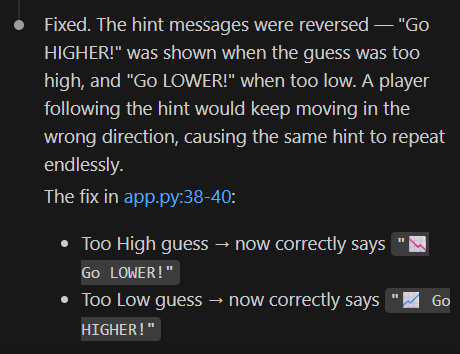
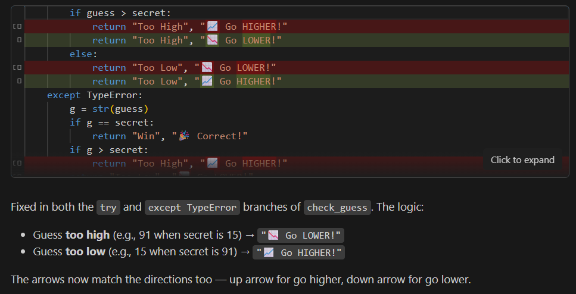
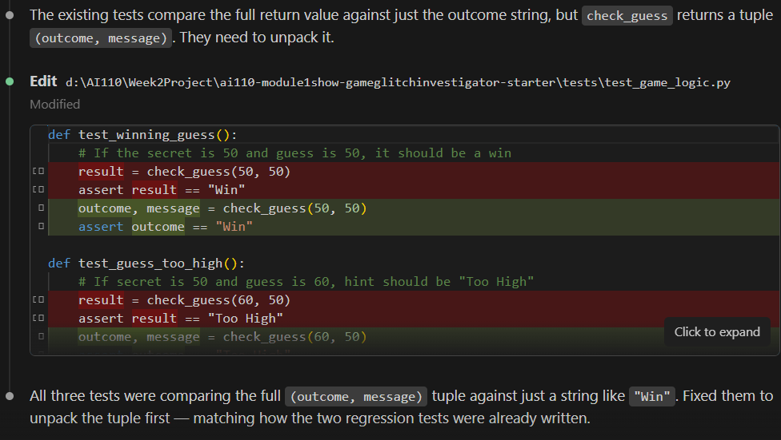
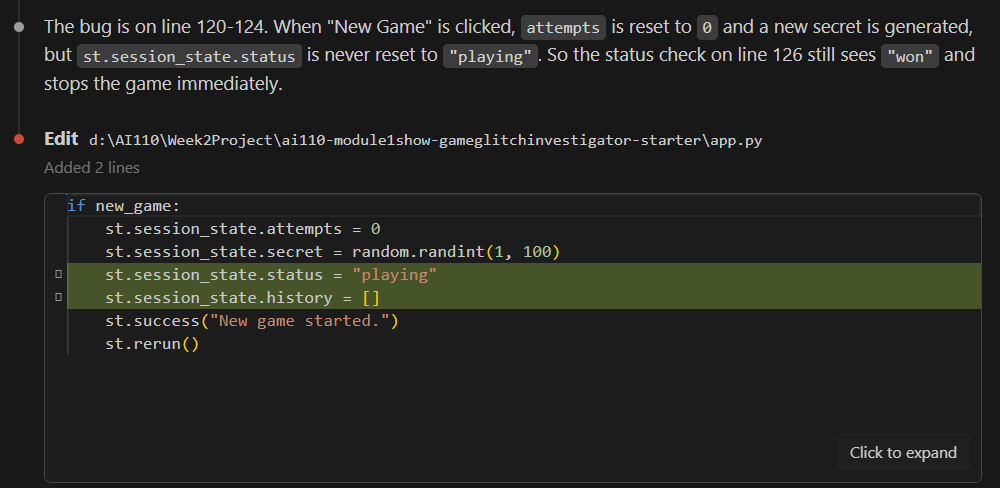
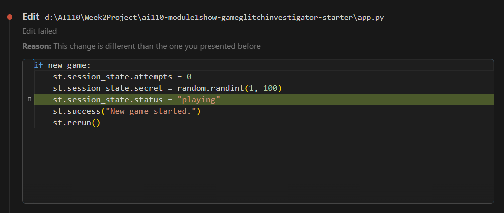
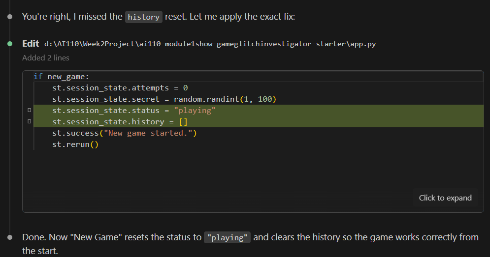
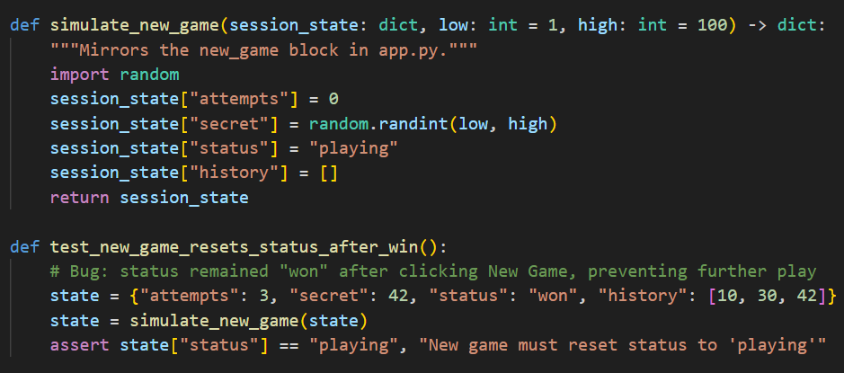

# 💭 Reflection: Game Glitch Investigator

Answer each question in 3 to 5 sentences. Be specific and honest about what actually happened while you worked. This is about your process, not trying to sound perfect.

## 1. What was broken when you started?

- What did the game look like the first time you ran it?
- List at least two concrete bugs you noticed at the start  
  (for example: "the hints were backwards").

  When I first ran the game it looked very simple to play. Each button was detailed and the play area is clearly defined. It was great to see that the Developer Debug I played a few games and noticed the following bugs

  1. When a user guesses with the "Show hint" option selected, the display "Go LOWER/HIGHER!" does not work properly. It repeats what the first message displayed throughout the game. I expected the appropriate message to display for the appropriate guess. 

  2. The "Range" for difficulty is not set properly. Normal should be 1 to 50 while Hard should be 1 to 100 and Easy should be 1 to 20. It is expected that the ranges should be match the difficulty setting.

  3. User history does not display properly. It seems that the first attempted is not recoreded but the remaining history is recorded. It is expected that all guesses are recorded properly.

  4. The number of guesses displayed is 8 but only 7 are allowed and recorded. It is expected for all 8 attempts should be given to the user.  

  5. The "New Game" button does not reset the history or allow the user to play the game again. It is expected that the user history and attempts are reset and the user is allowed to play again. 

---

## 2. How did you use AI as a teammate?

- Which AI tools did you use on this project (for example: ChatGPT, Gemini, Copilot)?
- Give one example of an AI suggestion that was correct (including what the AI suggested and how you verified the result).
- Give one example of an AI suggestion that was incorrect or misleading (including what the AI suggested and how you verified the result).

I used Claude on this project. 
#### AI Suggestion that was incorrect
I decided to mention the errors I was seeing on my end to see if Claude could identify them. I made the comment to Claude.

```"I noticed in this project that the "Show hint" option is not working properly. It seems that the same message pops up after each guess."```

It responded with the following. After the fix was made the same error I mentioned was still present.  



#### AI Suggestion that was correct
After the suggestion given was incorrect, I changed my prompt by giving and example of the error I came across. I prompted the following

```"When I guess 15 and the secret number is 91, the app is displaying the message to "Go LOWER!" when it should display to go higher."```

It then gave back a correct response about where the error occured. I attempted to play again and the guessing feature seems to work now. 



Next, I prompted Claude to explain what the error was and received a detailed response regarding the error. 


---

## 3. Debugging and testing your fixes

- How did you decide whether a bug was really fixed?
- Describe at least one test you ran (manual or using pytest)  
  and what it showed you about your code.
- Did AI help you design or understand any tests? How?

I decided that a bug was fixed by having Claude create a test for the incorrect message being displayed and having Claude create a pytest for it. After it created the pytest, I ran the tests myself to make sure they passed. 

The first time I asked Claude to create a test for the high/low error, it created the test below. It is mentioned that the existing tests only test `outcome` string, and not the `message` being sent so a test was created to test that both the `outcome` and `message` are being returned correctly from the `check_guess` function. 


I tested the pytests myself and saw that they were failing. After prompting Claude to check it out, we found the following error. It turns out that check guess, returns a tuple of outcome and message. The tests were failing due to `check_guess` being assigned to one variable `result` when it needed two variables to story results.  



It was after this, that all tests in `logic_utils.py` passed. Both `message` and `outcome` were being asserted. 

I also asked Claude about the error with starting a new game. I described the error as stated below

``` When I click on "New Game" my previous score is kept and my secret number changes but I am not allowed to play another a game. I see a message stating "You already won. Start a new game to play again."```

Claude gave the fix below but I had to step away for a bit and put my computer on sleep. 



When I came back, I told Claude gave me a different version of the fix. The `st.session_state.history[]` was missing. 



When I mentioned the difference between the two code, Claude mentioned that it missed the history reset and applied the changes. 



When complete, I asked Claude to create a pytest for this bug. It created a py test that simulated a new game and tested a successful win and three other tests for losing a game, history reset, new game reset, and generating a new secret number. 



---

## 4. What did you learn about Streamlit and state?

- In your own words, explain why the secret number kept changing in the original app.

The secret number kept changing in the original app because the secret number not stored in session state. Since it was not stored, Streamlit reruns and a new number would appear. 

- How would you explain Streamlit "reruns" and session state to a friend who has never used Streamlit?
Streamlit reruns the app based on actions, meaning it has to start the script again after a change is made. Session state makes sure values stay same when Streamlit reuns. However, if a variable is not part of session state, it will reset. 

When you think of a session state, you can think of a whiteboard and a paper printing. On a whiteboard, information will stay there until it is erased as is with session state. When you print multiple pieces of paper, the paper resets its information. 

- What change did you make that finally gave the game a stable secret number?

The change that made a stable secret number was making the secret number a part of the session state so that it would not reset when the Streamlit rerun the program. 

---

## 5. Looking ahead: your developer habits

- What is one habit or strategy from this project that you want to reuse in future labs or projects?
- This could be a testing habit, a prompting strategy, or a way you used Git.

One habit from this project that I would like to reuse is documenting the changes that were made by the AI agent that I am using. It is not a habit I have but feel its important to communicated for transparency. 


- What is one thing you would do differently next time you work with AI on a coding task?

One thing I would do differently the next time I work with AI on a coding task is to run the application myself and note the errors I am observing. Then create a detailed prompt of what I am seeing so AI can pinpoint where I can document the needed fix. 

- In one or two sentences, describe how this project changed the way you think about AI generated code.
This project helped me be more aware of the code that AI generates. It made me more wary of what it produces and allowed me to double check the its output as well as the changes that were made via testing and manual confirmation. 
